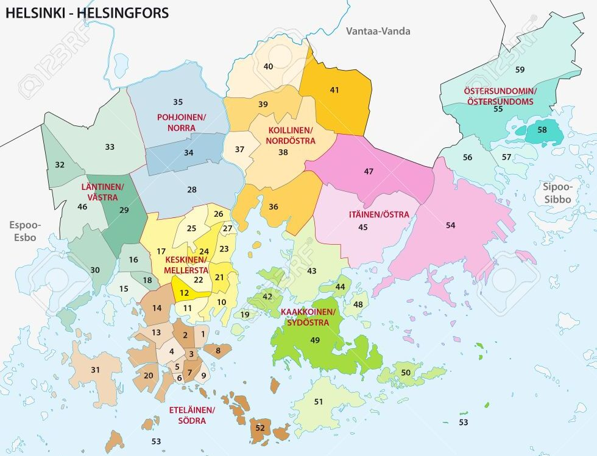

# Helsinki Region Housing Demand Estimation



data links:

https://hri.fi/data/en_GB/dataset/asuntotuotanto-helsingin-seudulla

https://hri.fi/data/en_GB/dataset/helsingin-seudun-aloitetut-ja-valmistuneet-asunnot

## Overview

This repository contains code and data for estimating the housing demand in the Helsinki Region for the upcoming years. The project aims to provide valuable insights to urban planners, developers, and policymakers to make informed decisions regarding housing development in the Helsinki Region.

## Table of Contents

- [Introduction](#introduction)
- [Data](#data)
- [Methodology](#methodology)
- [Usage](#usage)
- [Contributing](#contributing)
- [License](#license)

## Introduction

The Helsinki Region is experiencing rapid urbanization and population growth, leading to increased demand for housing. Accurate estimations of housing demand are essential for city planning, infrastructure development, and ensuring the availability of affordable housing for residents.

This project utilizes data analysis and predictive modeling techniques to estimate the future housing demand in the Helsinki Region. It takes into account various factors, such as population growth, economic indicators, and housing trends, to provide a comprehensive outlook on housing requirements.

## Data

We have collected and curated a diverse set of data sources to facilitate our housing demand estimation. These sources include:

- **Population Data:** Historical and projected population data for the Helsinki Region.
- **Economic Indicators:** Data on economic growth, employment rates, and income levels.
- **Housing Market Trends:** Information on housing prices, rental rates, and vacancy rates.
- **Urban Development Plans:** Insights into urban planning initiatives, infrastructure projects, and zoning regulations.
- **Environmental Factors:** Data on environmental sustainability and urban development.

The data used in this project is available in the `data` directory.

## Methodology

Our methodology for estimating housing demand involves several key steps:

1. **Data Preprocessing:** Cleaning and transforming raw data into a suitable format for analysis.
2. **Exploratory Data Analysis (EDA):** Exploring data patterns, correlations, and identifying relevant features.
3. **Feature Engineering:** Creating new features or modifying existing ones to improve model performance.
4. **Model Selection:** Choosing appropriate machine learning models for prediction.
5. **Training and Validation:** Training models on historical data and validating their performance.
6. **Forecasting:** Using trained models to estimate housing demand for future years.
7. **Visualization:** Creating informative visualizations to present the results.

## Usage

To use this repository for housing demand estimation in the Helsinki Region, follow these steps:

1. Clone the repository to your local machine:

   ```shell
   git clone https://github.com/your-username/helsinki-housing-demand.git
   ```

2. Install the required Python dependencies:

   ```shell
   pip install -r requirements.txt
   ```

3. Run the Jupyter notebooks in the `notebooks` directory to access the data analysis and modeling code.

4. Customize the model parameters, data sources, and features to suit your specific analysis and requirements.

5. Use the trained models to estimate housing demand for future years by providing relevant input data.

## Contributing

We welcome contributions from the community to improve the accuracy and utility of our housing demand estimation project. To contribute, follow these steps:

1. Fork the repository to your GitHub account.

2. Create a new branch for your contribution:

   ```shell
   git checkout -b feature/your-feature
   ```

3. Make your changes and commit them with clear, descriptive messages.

4. Push your changes to your forked repository.

5. Open a pull request, describing the purpose and details of your contribution.

Please adhere to our code of conduct and ensure that your contributions align with the project's goals.

## License

This project is licensed under the MIT License. See the [LICENSE](LICENSE) file for details.

---

Thank you for your interest in the Helsinki Region Housing Demand Estimation project. We hope that our work can contribute to informed decision-making and sustainable urban development in the region. If you have any questions or suggestions, please don't hesitate to reach out to us.
